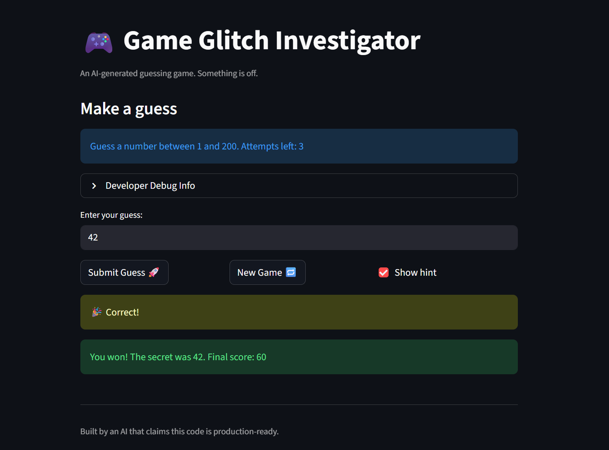

# 🎮 Game Glitch Investigator: The Impossible Guesser

## 🚨 The Situation

You asked an AI to build a simple "Number Guessing Game" using Streamlit.
It wrote the code, ran away, and now the game is unplayable. 

- You can't win.
- The hints lie to you.
- The secret number seems to have commitment issues.

## 🛠️ Setup

1. Install dependencies: `pip install -r requirements.txt`
2. Run the broken app: `python -m streamlit run app.py`

## 🕵️‍♂️ Your Mission

1. **Play the game.** Open the "Developer Debug Info" tab in the app to see the secret number. Try to win.
2. **Find the State Bug.** Why does the secret number change every time you click "Submit"? Ask ChatGPT: *"How do I keep a variable from resetting in Streamlit when I click a button?"*
3. **Fix the Logic.** The hints ("Higher/Lower") are wrong. Fix them.
4. **Refactor & Test.** - Move the logic into `logic_utils.py`.
   - Run `pytest` in your terminal.
   - Keep fixing until all tests pass!

## 📝 Document Your Experience

- [x] Describe the game's purpose.

  This is a number guessing game built with Streamlit. The player picks a difficulty (Easy, Normal, or Hard), and the app generates a secret number within a range. The player has a limited number of attempts to guess it, with hints telling them to go higher or lower after each guess.

- [x] Detail which bugs you found.

  1. **Inverted hints** — `check_guess` told the player "Go HIGHER!" when the guess was too high and "Go LOWER!" when too low.
  2. **Wrong Hard difficulty range** — Hard mode used 1-50 (easier than Normal's 1-100); it should be 1-200.
  3. **Hardcoded display range** — The info message always said "between 1 and 100" regardless of difficulty.
  4. **Score off-by-one** — Win score used `attempt_number + 1`, over-penalizing the player.
  5. **Inconsistent "Too High" scoring** — Sometimes added 5, sometimes subtracted 5 based on even/odd attempt number.
  6. **New Game didn't fully reset** — Didn't reset status, score, or history; hardcoded `random.randint(1, 100)` instead of using the difficulty range.
  7. **Invalid guesses cost attempts** — Empty or non-numeric input still incremented the attempt counter.

- [x] Explain what fixes you applied.

  1. Refactored all game logic into `logic_utils.py` with clean single-return functions, and imported them into `app.py`.
  2. Fixed `check_guess` to return just a string ("Win", "Too High", "Too Low") and added a `MESSAGES` dictionary in `app.py` for UI display text.
  3. Corrected the Hard difficulty range to 1-200 and made the info message use the actual `low`/`high` values.
  4. Fixed scoring to use `attempt_number` directly (no +1) and made "Too High" consistently subtract 5.
  5. Made the New Game button reset all session state (attempts, secret, status, score, history) using the correct difficulty range.
  6. Moved the attempt increment to only happen after a valid guess is parsed.

## 📸 Demo

- [x] 

## 🚀 Stretch Features

- [ ] [If you choose to complete Challenge 4, insert a screenshot of your Enhanced Game UI here]
